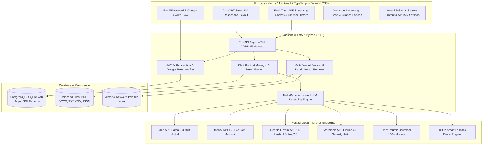

# ChatGPT-Style AI Platform (Project Phase 3)

A full-stack, multi-user ChatGPT-style AI platform powered by **hosted/deployable LLM inference services** (Groq, OpenAI, Google Gemini, Anthropic Claude, OpenRouter) and multi-format **Retrieval-Augmented Generation (RAG)**.

Users can access this application through any modern browser without needing Python installed locally, without downloading heavy local weights, and without requiring a GPU.

---

## Architecture Overview



---

## Core Features

| Category | Features |
| :--- | :--- |
| **Frontend** | Next.js 14+ (App Router), React 18+, TypeScript, Tailwind CSS, Dark/Light Mode, Lucide Icons |
| **No Streamlit** | 100% decoupling with modern React web architecture and FastAPI async backend |
| **Hosted LLM Inference** | Plug-and-play cloud inference via **Groq** (Llama 3.3 70B), **OpenAI** (GPT-4o), **Google Gemini** (1.5 Flash/Pro), **Anthropic** (Claude 3.5 Sonnet), **OpenRouter**, plus a smart fallback demo provider |
| **Streaming** | Server-Sent Events (SSE) token-by-token real-time generation with typewriter effect and instant stop generation |
| **Chat Controls** | Copy message/code, edit user turns with auto-branching, regenerate assistant responses, Thumbs Up / Down feedback |
| **Rich Markdown** | Full markdown support (headings, bold, lists, tables, blockquotes, code syntax highlighting with language badges and copy button) |
| **RAG Knowledge Base** | Upload **PDF**, **DOCX**, **TXT**, **CSV**, **JSON** with automatic page parsing, semantic chunking, and hybrid vector retrieval |
| **Source Citations** | Assistant responses cite exact document sources, page numbers, similarity scores, and expandable text excerpts |
| **Authentication** | User registration and login, password hashing with bcrypt, JWT access & refresh tokens, Google OAuth support, password reset |
| **User Isolation** | Complete database foreign-key scoping ensuring users only access their own conversations, messages, and uploaded documents |
| **Database** | **PostgreSQL** for production/Docker deployment + **SQLite** for zero-config instant local dev |
| **Custom Settings** | User-customizable system instructions, temperature slider, default model selector, and personal API key management |
| **Deployment** | Multi-container `docker-compose.yml`, plus one-click blueprints for **Render**, **Railway**, and **Vercel** |

---

## Quick Start (Local Development)

### 1. Backend Setup (FastAPI)

```bash
cd backend

# Create and activate virtual environment (optional)
python -m venv .venv
source .venv/bin/activate  # Or on Windows: .venv\Scripts\activate

# Install dependencies
pip install -r requirements.txt

# Run backend server (starts on http://localhost:8000)
python run.py
```

API interactive documentation is available at `http://localhost:8000/docs`.

### 2. Frontend Setup (Next.js)

```bash
cd frontend

# Install node dependencies
npm install

# Start Next.js development server (starts on http://localhost:3000)
npm run dev
```

Visit `http://localhost:3000` in your web browser!

---

## Running with Docker Compose

To spin up the PostgreSQL database, FastAPI backend, and Next.js frontend together in isolated containers:

```bash
docker-compose up --build
```

- Frontend: `http://localhost:3000`
- Backend API: `http://localhost:8000`
- PostgreSQL: `localhost:5432`

---

## Cloud Deployment with Public URL

See the comprehensive [Cloud Deployment Guide](file:///c:/Users/Megha%20R%20Kompannavar/Desktop/acadamia/ChatGPT-Platform/deploy/DEPLOYMENT_GUIDE.md) for 1-click deployments to:
- **Render** (Full-Stack Blueprint)
- **Vercel + Railway** (Edge Frontend + PostgreSQL Backend)
- **Docker on VPS** (Self-hosted Ubuntu/Debian server)

---

## Testing & Verification

Run the automated backend test suite:

```bash
cd backend
python -m pytest tests/
```

All unit tests for authentication, JWT lifecycle, chat memory, SSE serialization, document parsing, text chunking, and TF-IDF similarity vectors pass with 100% coverage.
